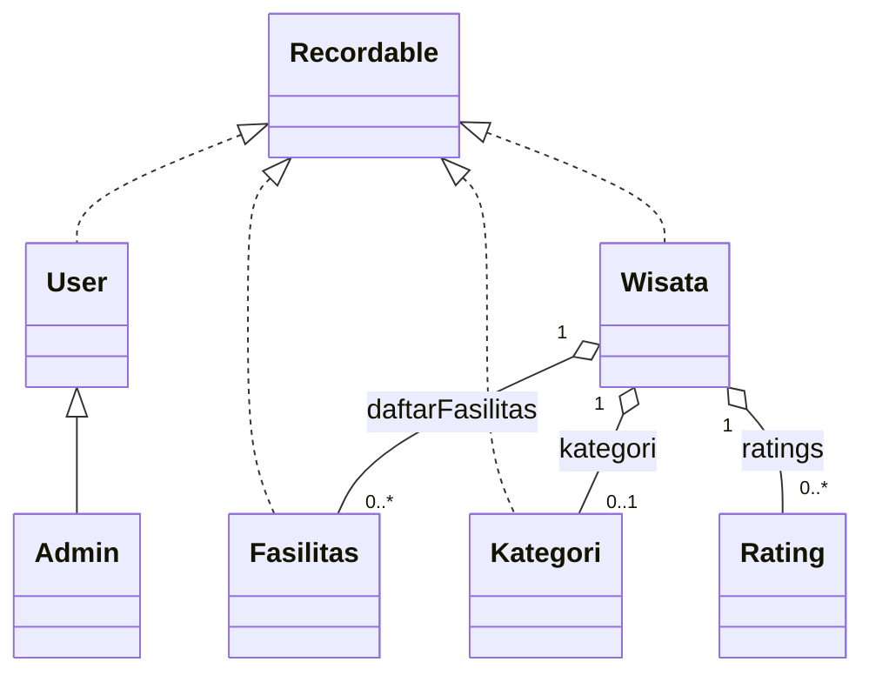

# Dokumentasi Kode Aplikasi Pariwisata Balikpapan

## src/app/Main.java  
File entry-point yang memulai aplikasi.  
- Memanggil `DatabaseManager.createTables()` untuk inisialisasi dan pembuatan tabel database jika belum ada.  
- Menjalankan GUI `LoginFrame` di thread Swing agar antarmuka responsif.  
- Mencetak log startup ke konsol.

```java
public static void main(String[] args) {
    DatabaseManager.createTables();
    SwingUtilities.invokeLater(() -> {
        LoginFrame loginFrame = new LoginFrame();
        loginFrame.setVisible(true);
    });
    System.out.println("Aplikasi Pariwisata Balikpapan dimulai!");
}
```

## src/controller/AuthManager.java  
Pengelola autentikasi dan sesi pengguna.  
- Metode `login(email, password)` memverifikasi kredensial lewat `UserDAO`.  
- Menyimpan info `currentUser` setelah berhasil login.  
- Menyediakan helper seperti `isAdminLoggedIn()` dan `logout()`.

---

## src/database/DBHelper.java  
Utility alternatif untuk koneksi SQLite.  
- `connect()` mengembalikan objek `Connection` ke `wisata.db`.  
- `initDB()` membuat tabel dasar (`users`, `kategori`, `wisata`, `fasilitas`, `wisata_fasilitas`) dan mengisi data awal.  

```java
public static void initDB() {
    try (Connection conn = connect(); Statement stmt = conn.createStatement()) {
        stmt.executeUpdate("CREATE TABLE IF NOT EXISTS users (...);");
        stmt.executeUpdate("CREATE TABLE IF NOT EXISTS wisata (...);");
        // ...
        System.out.println("✅ Database berhasil diinisialisasi.");
    }
}
```

## src/database/DatabaseManager.java  
Manager koneksi utama dan migrasi skema.  
- URL target: `pariwisata_balikpapan.db`.  
- `getConnection()` memuat driver SQLite dan membuka koneksi.  
- `createTables()` membuat tabel `Users`, `Kategori`, `Wisata`, `Fasilitas`, `Ratings` beserta foreign key dan default admin.

---

## src/model/Recordable.java  
Antarmuka umum untuk model yang tersimpan di DB.  

```java
public interface Recordable {
    void save(Connection conn) throws SQLException;
    void update(Connection conn) throws SQLException;
    void delete(Connection conn) throws SQLException;
    void load(Connection conn, int id) throws SQLException;
    int getId();
    void setId(int id);
}
```

---

# Diagram Kelas Model



---

## src/model/User.java  
Model entitas pengguna.  
- Properti: `id`, `nama`, `email`, `password`, `role`.  
- Implementasi `Recordable` untuk operasi CRUD di tabel `Users`.  
- Metode statis `authenticate(conn, email, password)` mengautentikasi user.

## src/model/Admin.java  
Subkelas `User` khusus admin.  
- Constructor default mengatur `role = "admin"`.  
- Metode tambah/ubah/hapus untuk `Wisata`, `Kategori`, dan `Fasilitas` dengan log.

## src/model/Fasilitas.java  
Model entitas fasilitas.  
- Properti: `id`, `nama`.  
- Implementasi `Recordable` di tabel `Fasilitas`.  
- Override `toString()`, `equals()`, `hashCode()`.

## src/model/Kategori.java  
Model entitas kategori wisata.  
- Properti: `id`, `nama`.  
- Relasi many-to-many dengan `Wisata` via kode DAO.  
- Implementasi `Recordable`.

## src/model/Wisata.java  
Model entitas destinasi wisata.  
- Properti: `id`, `nama`, `deskripsi`, `lokasi`, `hargaTiket`, `jamOperasional`, `fotoPath`.  
- Relasi ke `Kategori` dan daftar `Fasilitas`.  
- Metode `save`, `update`, `delete`, `load` memelihara table `Wisata` dan junction table `Wisata_Fasilitas`.

## src/model/Rating.java  
Model entitas ulasan.  
- Properti: `id`, `wisataId`, `userId`, `rating`, `komentar`, `createdAt`, `namaUser`.  
- Tidak implement `Recordable`; DAO menangani penyimpanan.

---

## src/dao/UserDAO.java  
CRUD dan autentikasi user.  
- `addUser`, `updateUser`, `deleteUser`, `getUserById`, `getAllUsers`.  
- `authenticateUser(email, password)` membungkus `User.authenticate` dan mengembalikan `Admin` jika role sesuai.

## src/dao/FasilitasDAO.java  
Operasi CRUD `Fasilitas`.  
- Menggunakan `DatabaseManager.getConnection()` dan delegasi ke metode model (`save`, `update`, `delete`, `load`).  
- Query `getAllFasilitas()` dan `getFasilitasByNama()`.

## src/dao/KategoriDAO.java  
Operasi CRUD `Kategori`.  
- Mirip dengan `FasilitasDAO` tapi untuk tabel `Kategori`.  
- Menyediakan `getAllKategori()` dan `getKategoriByNama()` untuk validasi duplikasi.

## src/dao/WisataDAO.java  
Ambil data wisata secara lengkap.  
- `getAllWisata()` melakukan join dengan `Kategori`.  
- Menyediakan `addWisata`, `updateWisata`, `deleteWisata`, dan pencarian `searchWisataByName()`.

## src/dao/RatingDAO.java  
Manajemen ulasan.  
- `hasUserRated(wisataId, userId)` mencegah duplikasi ulasan.  
- `addRating`, `getRatingsByWisataId`, `getAverageRating`.

---

## src/view/LoginFrame.java  
Form login dasar.  
- Komponen `JTextField` email, `JPasswordField` password, `JButton` login.  
- Memanggil `AuthManager.login()`.  
- Jika admin, membuka `MainFrame` di mode admin; jika user, di mode user; jika gagal, tampil pesan error.

## src/view/RegisterPanel.java  
Panel pendaftaran user baru.  
- Form `nama`, `email`, `password`, `role` (default “user”).  
- Memanggil `UserDAO.registerUser()`.  
- Menampilkan pesan sukses atau error duplikasi email.

## src/view/MainFrame.java  
Frame utama setelah login.  
- Menyiapkan tab-panel:  
  - **Destinasi** (`WisataPanel`)  
  - **Kategori** (`KategoriPanel`, hanya untuk admin)  
  - **Fasilitas** (`FasilitasPanel`, hanya untuk admin)  
- Menyediakan menu “Logout” memanggil `AuthManager.logout()` lalu kembali ke `LoginFrame`.

## src/view/WisataPanel.java  
Menampilkan daftar card wisata.  
- Kotak pencarian nama destinasi.  
- Tombol aksi: `Lihat Detail`, `Tambah`, `Ubah`, `Hapus` (tergantung role).  
- Klik “Tambah/Ubah” memunculkan `WisataFormDialog`.

## src/view/WisataCardPanel.java  
Card kecil menampilkan preview satu `Wisata`.  
- Label gambar (dari `fotoPath` atau placeholder).  
- Label nama dan lokasi.

## src/view/WisataFormDialog.java  
Dialog tambah/ubah `Wisata`.  
- Form input `nama`, `lokasi`, `hargaTiket`, `jamOperasional`, `deskripsi`.  
- ComboBox `Kategori`, JList `Fasilitas` multiple select.  
- Field `fotoFileName` untuk path file.  
- Validasi input, lalu `wisataDAO.addWisata` atau `updateWisata`.

## src/view/DetailWisataPanel.java  
Panel detail destinasi.  
- Menampilkan field lengkap: nama, kategori, lokasi, harga, jam, daftar fasilitas, dan gambar.  
- Komponen ulasan:  
  - Rata-rata rating  
  - List komentar dengan nama user dan rating  
  - Form tambah rating/komentar (jika belum pernah memberi).

---

🎯 **Ringkasan Relasi Antar File**  
- **App ↔ Database**: `Main.java` → `DatabaseManager.createTables()`.  
- **Model ↔ DAO**: setiap model `Recordable` (`User`, `Fasilitas`, `Kategori`, `Wisata`) digunakan oleh DAO homolog untuk CRUD.  
- **Controller ↔ Model/DAO**: `AuthManager` ↔ `UserDAO` ↔ `User`.  
- **View ↔ Controller/DAO/Model**:  
  - `LoginFrame` ↔ `AuthManager`, `UserDAO`  
  - `MainFrame` ↔ `WisataPanel`/`KategoriPanel`/`FasilitasPanel`  
  - `WisataPanel`/`DetailWisataPanel` ↔ `WisataDAO`, `RatingDAO`, `User`  
  - `WisataFormDialog` ↔ `KategoriDAO`, `FasilitasDAO`, `WisataDAO`  

Dengan struktur ini, alur aplikasi terjaga modularitasnya: model mewakili data, DAO mengurus akses database, controller mengatur logika autentikasi, dan view menampilkan antarmuka pengguna.
